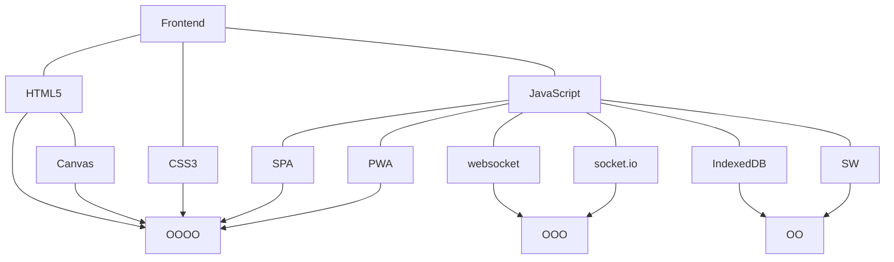
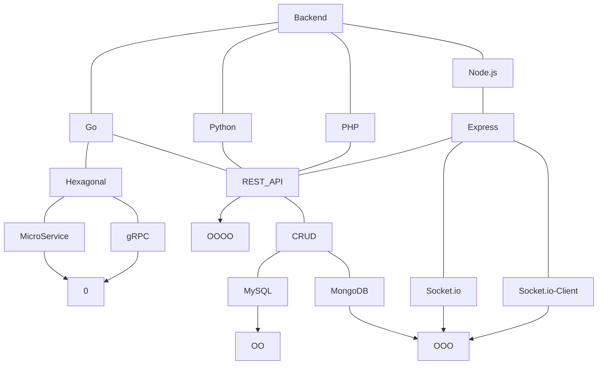
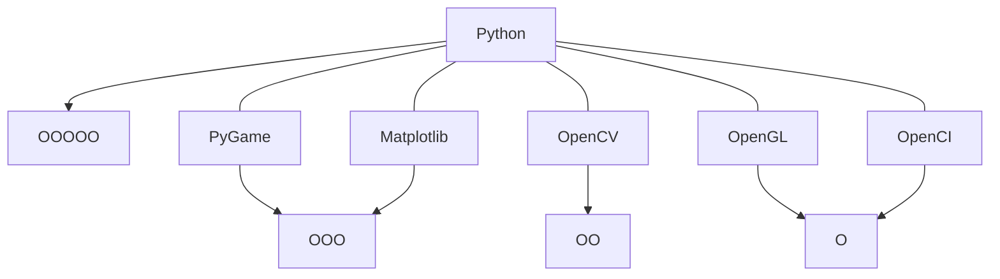
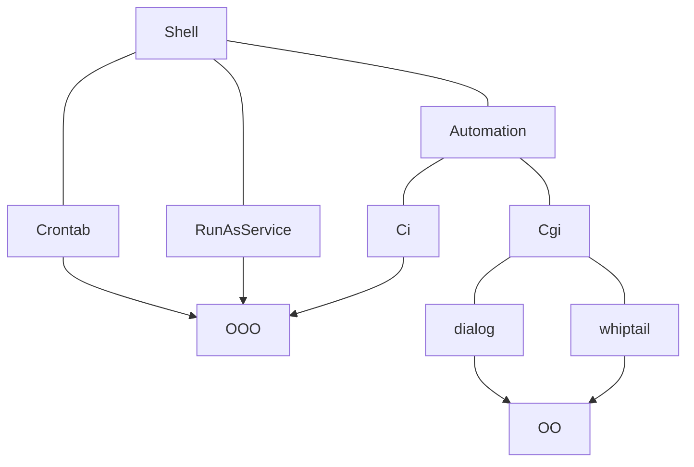
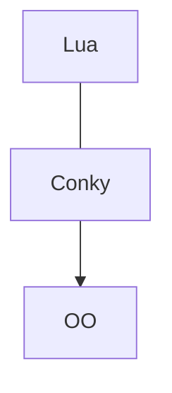
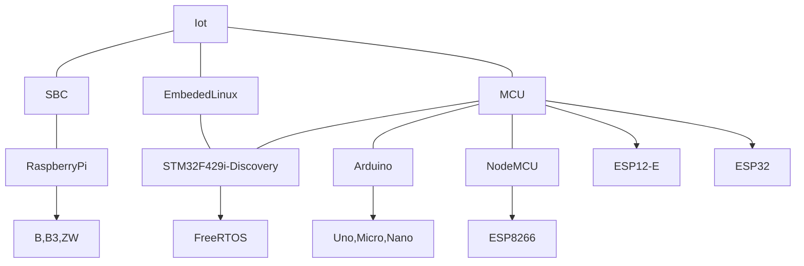

<h1 align="center">Hi 👋, I'm TypeNaN</h1>
<h3 align="center">A passionate developer from Thailand</h3>
<!-- <h3 align="center">I have more than 14 years✨ of programming experience</h3> -->

---

<!-- - 🔭 I’m currently working on [Dictionary](https://github.com/TypeNaN/dictionary)
- 🌱 I’m currently learning **Go, Hexagonal, gRPC, Radis, Docker, K8s**
- 👨‍💻 All of my projects are available at [https://github.com/TypeNaN](https://github.com/TypeNaN)
- 📝 I regularly write articles on [https://dev.to/typenan](https://dev.to/typenan)
- 💬 Ask me about **Linux, Programing**

--- -->

<h1 align="center">🔪 MY SUPER WEAPON</h1> 

| | **Laptop Acer Aspire 4551G** |
| --- | --- |
| model name | AMD Athlon(tm) II N330 Dual-Core Processor |
| cpu cores | 2 x 800.000 MHz
| cache size | 512 KB
| graphic | ATi Mobility Radion(tm) HD5470 |
| ram | 4GB + Swap 4GB
| storage | SSD 512GB
| os | Ubuntu x86_64 GNU/Linux

 

---

<h1 align="center">💻 TECH STACK</h1> 

 

 

 

 

 

 

 

 

  

  

 

---

<h1 align="center">🔌 CONNECT WITH ME</h1> 

---

### Blogs posts: 
<!-- BLOG-POST-LIST:START -->
- [01-Go Install](https://dev.to/typenan/01-go-install-50bm)
- [00-Go สารบัญ](https://dev.to/typenan/01-go-install-8n3)
- [User Registration and Login Template using Golang, MongoDB and JWT](https://dev.to/typenan/user-registration-and-login-template-using-golang-mongodb-and-jwt-5d3p)
- [Unlimited Bash History](https://dev.to/typenan/unlimited-bash-history-4mdd)
<!-- BLOG-POST-LIST:END -->

---

### การศึกษา (Education): 
| ปี (Year) | สถานศึกษา (School) | หมายเหตุ (Comment) |
| --- | --- | --- |
| **2543** (2000) | ป.6 โรงเรียนพิบูลประชาบาล  Grade 6, Phibun Prachaban School | |
| **2546** (2003) | ม.3 โรงเรียนมัธยมวัดศรีจันทร์ประดิษฐ์ Mathayom 3, Wat Si Chan Pradit Secondary School | |
| **2546-2550** (2003-2007) | ปวช. "อิเล็กทรอนิกส์ ทวิภาคี" วิทยาลัยเทคนิค สมุทรปราการ Vocational Certificate "Electronics, Bilateral" Samut Prakan Technical College | **ไม่จบ** (not graduated) |
| **2552** (2009) | ม.6 กศน. บุรารักษ์ Mathayom 6, Non-formal Education Burarak | |

---

### การทำงาน (Experience): 

| ปี | บริษัท | ตำแหน่ง |
| --- | --- | --- |
| **2552-2553** (2009-2010) | A&P | Deep clean เครื่องบินสายการบินไทยและเครื่องบินพระที่นั่ง |
| **2553** | สนามบินสุวรรณภูมิ | เจ้าหน้าที่เกษตร นำตรวจสินค้าเกษตรส่งออก **คลัง TG**  |
| **2553-2554** | HENG HENG INKJET | Graphic Design |

---

### งานอิสระ (Freelance): 

| งาน | พัฒนาด้วย | ปี  |
| --- | --- | --- |
| จัดทำและดูแลเว็บไซต์ **(ชมรมสยามภูคา)** Website (Siam Phu Kha Club) | PHP | **2548** (2005) |
| จัดทำและดูแลเว็บไซต์ **(สภ.บางปู)** Website (Bang Pu Police Station) | GCMS (Ajax+PHP) | **2552-2555** (2009-2012) |
| ออกแบบหน้าเว็บไซต์ **(โปรเจ็คท์นักศึกษา)** Web page design (Student project) | Javascript | **2553** (2010) |
| ดูแลระบบวิทยุออนไลน์ **(สถานีวิทยุปู่เจ้า 101.25 MHz)** Online radio administration  (Pu Chao Radio Station 101.25 MHz) | Shoutcast + SAM + PHP | **2553-2554** (2011-2012) |
| จัดทำและดูแลเว็บไซต์ **(ประเวศอิงค์เจ็ท)** Website [billboard manufacturing (Prawet inkjet)] | GCMS (Ajax+PHP) | **2554-2565** (2011-2022) |
| จัดทำและดูแลเว็บไซต์ **(อู่เล็กคาร์แก็ส)** Website (Lex Car Gas Garage) | Javascript | **2554-2555** (2011-2013) |
| ออกแบบหน้าเว็บไซต์ **[ขายนาฬิกา (ผู้ว่าจ้างชาวต่างชาติ)]** Web page design [selling watches (foreign employers)] | Static page HTML5 | **2555** (2012) |
| เว็บแอพฯ จัดการคลัง **[ร้านเกรป (สินค้า 20.-)]** Web app to manage inventory [Grape shop (products 20฿)] | JS + Firebase | **2560** (2017) |
| เว็บแอพฯ สั่งอาหาร **(ร้านเตี๋ยวไก่กลมกล่อม)** Web app food delivery (Tiao Kai Klom Klom Restaurant) | JS + Firebase + LineOA | **2562** (2019) |
| ดูแลสื่อสิ่งพิมพ์และเว็บไซต์บริษัทเครื่องสำอางค์ Publications and websites of cosmetic companies. (Mamatell) | JS + Firebase | **2562-2565** (2019-2022) |

 

    

---

 

| ประวัติย่อ | Resume |
| --- | --- |
| มีความสนใจในด้านคอมพิวเตอร์มาตั้งแต่เด็ก หัดเขียนโปรแกรมครั้งแรกจากการเรียนรู้ด้วยตนเองสมัยเรียน ปวช. ปี 1 จากการเขียนเว็บด้วย HTML+PHP แล้วหัด JS+CSS มาเพิ่มลูกเล่นและความสวยงามให้หน้าเว็บ ก่อนจะหันมาลองเขียนเกมด้วย C++, DirectX, CDX ในปีเดียวกัน     สำหรับงานเขียนโปรแกรมส่วนใหญ่เป็นไปในทางงานอดิเรกโดยเขียนขึ้นจากความต้องการส่วนตัวเพื่อการศึกษาหรือเพื่อลดขั้นตอนงานรวมทั้งหารายได้พิเศษ นอกจากนี้ยังทดลองนำคอมเก่าๆ ทำ server เรียนรู้การคอนฟิกอย่าง apache, nginx, node.js, tor deepweb, shoutcast ในระหว่างทำงานประจำก็มีรับงานเขียนเว็บหรือเว็บแอพเล็กๆ อยู่บ้างตามที่แสดงในตารางด้านบน     ปัจจุบันยังคงเรียนรู้ด้วยตนเองและเปิดรับความรู้ใหม่ๆ อยู่เสมอ | I have been interested in computers since childhood Learned to write a program for the first time self-taught when I was in vocational school year 1 from writing a web page with HTML+PHP and learning JS+CSS to add features and beauty to the web page. before trying to write games with C++, DirectX, and CDX in the same year.   As for programming, most of them are hobbyists, writing out of personal needs for education or to reduce the workflow and earn extra money. In addition, I also tried to use old computers to create servers, and learn to configure them such as Apache, Nginx, Node.js, Tor deep web, and Shoutcast. My freelance work some as shown in the table above.    Currently, I am still self-learning and am always open to new knowledge.|

---

 

| กำลังมองหา  | Looking for |
| --- | --- |
| งานประจำที่มีการทำงานเป็นทีม การใช้เครื่องมือ, เฟรมเวิร์ค, เทคนิคใหม่ๆ ในการทำงาน | Full-time work with teamwork, Tooling, Framework, New techniques to develop potential at work |

---

 

| ความสนใจ  | Attentions |
| --- | --- |
| เขียนโปรแกรม, ลินุกซ์ เซิร์ฟเวอร์, ปัญญาประดิษฐ์, อิเล็กทรอนิกส์, สมองกลฝังตัว, หุ่นยนต์, รถยนต์ไฟฟ้า | Programming, Linux Server, Machine Learning, Electronics, Embedded System, Micro Controller, Robot, electric car |

---

### ทักษะ (Skill): 

| | | | |
| --- | --- | --- | --- |
| Computer | | | |
| | Hardware | | |
| | | SBC, MCU, iot | OOO |
| | | Network, Server, Hosting, Database, Cloud, Cluster | OO |
| | Graphic & Design | | |
| | | Photoshop, illustrator | OOO |
| | | Inkscape, Gimp, Krita, Blender | O |
| | Programing | | |
| | | Python, JavaScript, Node.js | OOOOO |
| | | Shell | OOO |
| | | Lua, Go, C/C++, MQL4&5 | OO |
| | Programing Technical | | |
| | | Low level hardware communication | OO |
| | | Multi-Process, Multi-Thread, Parallel | OO |
| | | Encypt & Decypt | OO |
| | | Block chain | OO |
| | | Sound & Image processing | OO |
| | | Machine Learning, Neural network | OO |
| | | | |
| English | | | |
| | Listen, Read | | O |
| | Speak, Write | | O |
| | | | |
| Typing | | | |
| | Thai | | NA |
| | English | | <a href="https://monkeytype.com/profile/TypeNaN" target="_blank">Monkeytype</a> |

---

---

---

---

---

---

---

<h1 align="center">🎮 HOBBY</h1> 

### โครงงานที่ประสบความสำเร็จ: 

- Voice recognition จาก Raspberry pi [ภาษา Python] (คลิกภาพเพื่อรับชมคลิป) 

- Ai แม่หญิงการะเกด [ภาษา Python] (คลิกภาพเพื่อรับชมคลิป) 

- Expert Advisor เทรด Forex บน Metatrader 4 & 5 [ภาษา MQL4&5] (คลิกภาพเพื่อรับชมคลิป) 

- DIY เครื่องขุดเหรียญคริปโต จาก ESP-8266 และ ESP12-E [ภาษา C/C++] (คลิกภาพเพื่อรับชมคลิป) 

- DIY Compact Camera via Raspberry pi [ภาษา Python] (คลิกภาพเพื่อรับชมคลิป) 

- DIY เครื่องตรวจจับอุณหภูมิจาก Raspberry pi [ภาษา Python] (คลิกภาพเพื่อรับชมคลิป) 

- DIY เครื่อง CNC จาก Aduino [ภาษา C/C++] (ขออภัยไม่มีภาพ)
- DIY Live streaming cam [ภาษา Python] (ขออภัยไม่มีภาพ)

---

### โครงงานที่กำลังทำอยู่: 

- พจนานุกรมไทย [ภาษา Node.js] (คลิกภาพเพื่อไปยัง Repository) 

---

### โครงงานในอนาคต: 

- แชทบอทข้อความ
- แชทบอท TTS <-> STT
- Standalone voice assistant
- Online voice assistant
- Automobile intelligent