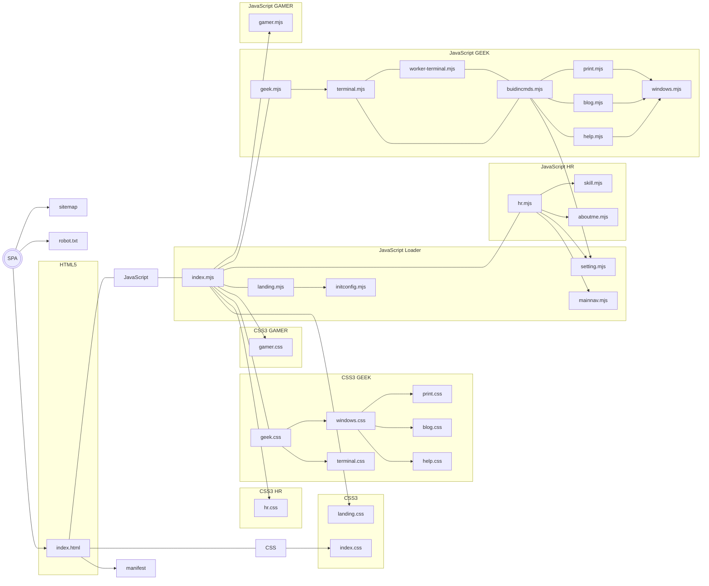

```mermaid
%%{ init: { 'flowchart': { 'curve': 'bump' } } }%%
graph LR;
  SPA(((SPA)))
  SPA-->index.html;
  SPA-->robot.txt;
  SPA-->sitemap;
  
  index.html-->manifest;
  index.html---CSS;
  index.html---JavaScript;

  CSS-->index.css;
  JavaScript---index.mjs;

  index.mjs--->landing.css
  index.mjs-->hr.css;
  index.mjs---geek.css;
  index.mjs-->gamer.css;

  index.mjs---landing.mjs;
  index.mjs---hr.mjs;
  index.mjs---geek.mjs;
  index.mjs-->gamer.mjs;

  landing.mjs-->initconfig.mjs;

  hr.mjs-->mainnav.mjs;
  hr.mjs-->setting.mjs;
  hr.mjs-->aboutme.mjs;
  hr.mjs-->skill.mjs;

  geek.css-->terminal.css;
  geek.css-->windows.css;

  windows.css-->help.css;
  windows.css-->blog.css;
  windows.css-->print.css;

  geek.mjs-->terminal.mjs;

  terminal.mjs---buidincmds.mjs;
  terminal.mjs---worker-terminal.mjs;

  worker-terminal.mjs---buidincmds.mjs;
  
  buidincmds.mjs-->setting.mjs;
  buidincmds.mjs---help.mjs-->windows.mjs;
  buidincmds.mjs---blog.mjs-->windows.mjs;
  buidincmds.mjs---print.mjs-->windows.mjs;

  subgraph HTML5;
    index.html;
  end;
  
  subgraph CSS3;
    landing.css;
    index.css;
  end;

  subgraph CSS3 HR;
    hr.css;
  end;

  subgraph CSS3 GEEK;
    geek.css;
    terminal.css;
    windows.css;
    help.css;
    blog.css;
    print.css;
  end;

  subgraph CSS3 GAMER;
    gamer.css;
  end;

  subgraph JavaScript Loader;
    index.mjs;
    landing.mjs;
    setting.mjs;
    initconfig.mjs
    mainnav.mjs;
  end;

  subgraph JavaScript HR;
    hr.mjs;
    aboutme.mjs;
    skill.mjs;
  end;

  subgraph JavaScript GEEK;
    geek.mjs;
    terminal.mjs;
    windows.mjs;
    worker-terminal.mjs;
    buidincmds.mjs;
    help.mjs;
    blog.mjs;
    print.mjs;
  end;

  subgraph JavaScript GAMER;
    gamer.mjs;
  end;
```